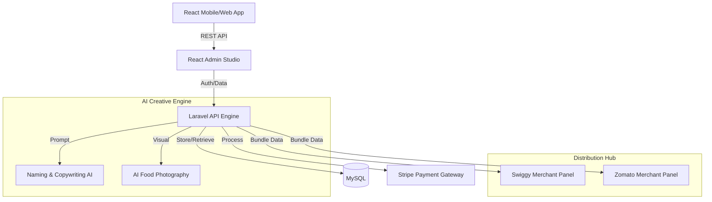

# 🍱 FoodHub: The AI-Powered Merchant Ecosystem

[](https://laravel.com)
[](https://react.dev/)
[](https://openai.com/)
[](https://stripe.com/)

**FoodHub** is a premium, full-stack food delivery and management ecosystem that bridges the gap between local merchants and the global digital economy. Built with a "Merchant-First" philosophy, it leverages generative AI to automate branding and content creation while providing a centralized hub for multi-platform distribution. Recently upgraded with a **Premium E-Commerce UX**, featuring cinematic gradients, glassmorphism, and seamless transactional workflows.

---

## 🏗️ System Architecture

FoodHub utilizes a robust **Monolithic Service Pattern** for maximum development speed and data integrity, supported by high-performance frontend interfaces.



---

## 🚀 Key Features

### 🎨 Premium User Experience (UX/UI)
*   **High-Fidelity Interface**: Completely redesigned app and admin panel featuring glassmorphism, cinematic gradients, and a bespoke typography system (`Outfit`).
*   **Micro-Interactions**: Smooth, gesture-driven animations powered by `Framer Motion` across navigation, carts, and product cards.
*   **Dynamic Cart & Checkout**: Robust cart tracking, coupon application, and tax calculation presented in a visually stunning floating checkout layout.

### 🤖 AI Merchant Production Studio
*   **AI Naming Wizard**: Transforms simple keywords into creative, high-converting culinary dish names.
*   **Sensory Copywriting**: Automatically generates professional, SEO-optimized product descriptions focusing on flavor profiles and ingredients.
*   **AI Food Photography**: Concept-aware image generation that produces 8k, restaurant-grade visuals based on product descriptions.

### 📦 Multi-Platform Distribution Hub
*   **Platform-Ready Bundling**: Instant data formatting and clipboard synchronization for **Swiggy** and **Zomato** merchant panels.
*   **Unified Inventory**: Manage your catalog in one place and sync visuals and metadata across all external delivery platforms.

### 📊 Intelligence Dashboard
*   **Live Statistics**: Real-time tracking of Revenue, Volumes, and Operational Visibility.
*   **Smart Inventory Monitoring**: Automated tracking of "Low Stock" items with category-based filtering for high-speed management.

### 💳 Secure Financial Flow
*   **Hybrid Payment Gateway**: Complete integration with Stripe for Credit Cards and native Support for Cash on Delivery (COD).
*   **Admin-Initiated Payments**: Securely convert COD orders to online transactions directly from the admin panel to minimize delivery risk.

---

## 🛠️ Technology Stack

| Layer | Technology | Role |
| :--- | :--- | :--- |
| **Backend** | Laravel 12 (PHP) | Professional Service-Layer, Order Processing & API Engine |
| **Frontend** | React + Vite | High-Fidelity, Gesture-Driven Mobile and Web Interfaces |
| **AI Integration** | Generative AI | Naming, Copywriting, and Imagery Automation |
| **Payments** | Stripe | Secure Multi-Channel Transaction Flow |
| **Design System** | TailwindCSS + Framer Motion | Premium Glassmorphism, Cinematic Colors & Micro-animations |
| **Database** | MySQL | Atomic Data Synchronization & Order State Management |

---

## 🏁 Getting Started

### 1. Prerequisites
*   **PHP 8.2+** & **Composer**
*   **Node.js 18+** & **npm**
*   **MySQL** Database

### 2. Backend Setup
```bash
cd backend
composer install
cp .env.example .env
php artisan key:generate
php artisan migrate --seed
php artisan serve --port=8000
```

### 3. Frontend Setup (Admin & Mobile)
```bash
# For Admin Panel
cd admin
npm install
npm run dev

# For Mobile App
cd mobile
npm install
npm run dev
```

---

## 🔒 Security Configuration
The project utilizes environment variables for sensitive API keys. Ensure the following are configured in your `backend/.env`:
*   `STRIPE_KEY` & `STRIPE_SECRET`: Integration with the payment gateway.
*   `GEMINI_API_KEY` (or chosen AI Provider): Powering the creative content studio.

---

## 📂 Project Structure
```text
.
├── admin/               # React Admin Dashboard (Vite)
├── mobile/              # React Mobile Customer App
├── backend/             # Laravel API & Business Logic
├── docker/              # Containerization services
└── README.md            # You are here
```

---

Developed with ❤️ by **[Vipul Tikhe](https://github.com/vipultikhe234)**
